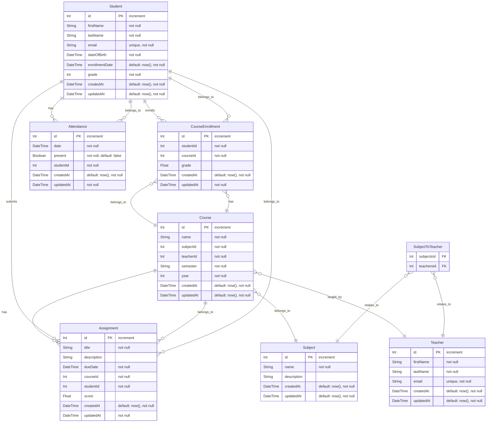

# Student Management System: Full-Stack Educational Database Application

## Project Introduction

I designed and implemented a comprehensive student management platform that demonstrates advanced integration between relational database concepts and modern web development patterns. This full-stack application showcases my ability to solve complex technical challenges while maintaining clean architecture and code reusability.


## Technical Stack

- **Frontend**: Next.js 14 (App Router), React, TypeScript, TailwindCSS
- **Form Management**: React Hook Form with Zod validation
- **UI Components**: ShadCN UI component library
- **Data Management**: Prisma ORM with PostgreSQL
- **State Management**: React Server Components + Server Actions

## Technical Achievement Highlights

### 1. Advanced Form State Management with Server Actions

I developed a sophisticated approach to handling form validation that integrates Next.js server actions with client-side form libraries. This approach provides:

- Server-side data validation for security
- Real-time form feedback using React's useEffect
- Non-blocking UI updates with useTransition
- Toast notifications for user feedback

```typescript
// Server validation errors synchronized with client form state
useEffect(() => {
  if (state?.errors) {
    Object.entries(state.errors).forEach(([key, value]) => {
      if (Array.isArray(value)) {
        form.setError(key as keyof z.infer<typeof assignmentCreateSchema>, {
          message: value.join(", "),
        });
      }
    });
  }
}, [state?.errors, form]);

// Form submission with optimistic UI updates
onSubmit={form.handleSubmit((data) => {
  const formData = new FormData();
  for (const key in data) {
    const typedKey = key as keyof typeof data;
    if (data[typedKey] instanceof Date) {
      formData.append(key, data[typedKey].toISOString());
    } else {
      formData.append(key, data[typedKey] as string | Blob);
    }
  }
  startTransition(() => {
    formAction(formData);
  });
})}
```


This pattern demonstrates my ability to work with advanced React concepts and create seamless user experiences that maintain data integrity.

### 2. Relational Data Handling with Custom Components

I created a reusable ComboboxField component that elegantly handles relationships between database entities:

```typescript
<ComboboxField
  label="Student"
  name="studentId"
  data={students}
  form={form}
  generateName={(student) => `${student.firstName} ${student.lastName}`}
/>
```


The component features:
- Dynamic data rendering with a flexible `generateName` function
- Type-safe implementation using TypeScript generics
- Consistent UI patterns across different entity relationships
- Integrated form validation with React Hook Form

This approach allowed me to maintain consistent UI patterns while handling complex database relationships with minimal code duplication.

### 3. Schema-Driven Database Operations

I implemented a schema-first approach using Zod for validation that creates a seamless connection between database models and UI forms:

```typescript
export const assignmentCreateSchema = z.object({
  title: z.string().max(100).nonempty(),
  description: z.string().max(1000).nullable(),
  dueDate: z.date(),
  courseId: z.coerce.number().int().positive(),
  studentId: z.coerce.number().int().positive(),
  score: z.coerce.number().min(0).max(100).nullable(),
});
```

This approach provides:
- Consistent validation rules across client and server
- Type inference for form state and database operations
- Early error detection before database operations
- Self-documenting code that clearly expresses constraints

## System Architecture

### Data Models

The system manages several related entities with a well-designed relational structure:



### Implementation Architecture

I designed the system with education-specific workflows in mind while maintaining a consistent pattern across different database entities:

1. **Data Retrieval Layer**: Server components fetch data with appropriate relationships
2. **Action Layer**: Type-safe server actions handle data operations with error handling
3. **Form Layer**: Reusable form components with consistent validation patterns
4. **UI Layer**: Data tables with filtering, pagination, and inline actions

## Problem-Solving Showcase

### Challenge: Server-Client State Synchronization

**Problem:** Educational applications require robust validation that works both on the client for immediate feedback and on the server for data integrity.

**Solution:** I developed a pattern that:
1. Collects form data on submission
2. Transforms dates and complex values to appropriate formats
3. Submits data to server actions in a non-blocking way
4. Synchronizes server validation errors with client form state
5. Provides toast notifications for operation status

The implementation showcases my ability to think through complex state management problems and create elegant solutions that enhance user experience while maintaining data integrity.

### Challenge: Relationship Management in Forms

**Problem:** Educational data often involves complex relationships between entities (students, courses, assignments), which must be represented intuitively in user interfaces.

**Solution:** I created a flexible ComboboxField component that:
1. Accepts any Prisma model type through TypeScript generics
2. Allows customizable display names through a function prop
3. Integrates with form validation systems
4. Provides consistent UI across different relationship types

This solution showcases my ability to abstract complex patterns into reusable components.

## Key Features Implementation

### Interactive Data Tables

Each entity has a dedicated data table with filtering, pagination, and row actions:

```tsx
<DataTable
  columns={columns}
  data={assignments}
  students={students}
  courses={courses}
/>
```


### Row-Level Actions

Each row has a dropdown menu with edit and delete options:

```tsx
<DropdownMenu>
  <DropdownMenuTrigger asChild>
    <Button variant="ghost" className="h-8 w-8 p-0">
      <MoreHorizontal className="h-4 w-4" />
    </Button>
  </DropdownMenuTrigger>
  <DropdownMenuContent align="end">
    <DropdownMenuLabel>Actions</DropdownMenuLabel>
    <DialogTrigger asChild>
      <DropdownMenuItem>
        <Edit /> Edit
      </DropdownMenuItem>
    </DialogTrigger>
    <DropdownMenuItem onClick={() => deleteAssignment(assignment.id)}>
      <Trash /> Delete
    </DropdownMenuItem>
  </DropdownMenuContent>
</DropdownMenu>
```


### Server-Side Data Operations

The application uses Next.js Server Actions for data operations, providing a clean separation of concerns:

```typescript
// Server-side action for creating assignments
export async function createAssignment(
  prevState: CreateAssignmentState,
  formData: FormData
): Promise<CreateAssignmentState> {
  const parseResult = assignmentCreateSchema.safeParse({
    title: formData.get("title") as string,
    // ...other fields
  });
  
  // Validation and database operations
  // ...
}
```

## Technical Skills Demonstrated

This project demonstrates proficiency in:

1. **Database Design**: Creating efficient relational models with appropriate constraints
2. **Type-Safe Development**: End-to-end TypeScript with Zod validation
3. **React Patterns**: Advanced hooks usage including useTransition and custom effects
4. **Server Actions**: Next.js server-side operations with client integration
5. **Form Management**: Complex validation and state synchronization
6. **Component Architecture**: Reusable and composable UI patterns

## Directory Structure

Each entity follows a consistent pattern:

```
src/
├── app/
│   ├── assignments/
│   │   ├── AssignmentCreateForm.tsx
│   │   ├── AssignmentEditForm.tsx
│   │   ├── columns.tsx
│   │   ├── data-table.tsx
│   │   └── page.tsx
│   ├── students/
│   │   └── ...
│   ├── courses/
│   │   └── ...
│   └── ...
├── components/
│   ├── FormElements/
│   │   ├── BooleanField.tsx
│   │   ├── ComboboxField.tsx
│   │   ├── DateField.tsx
│   │   ├── EmailField.tsx
│   │   ├── NumberField.tsx
│   │   ├── StringField.tsx
│   │   ├── TextAreaField.tsx
│   │   └── index.ts
│   └── ui/
│       └── ...
├── lib/
│   ├── actions/
│   │   ├── assignments.ts
│   │   ├── students.ts
│   │   ├── courses.ts
│   │   └── ...
│   ├── schemas/
│   │   ├── assignment.ts
│   │   ├── student.ts
│   │   ├── course.ts
│   │   └── ...
│   ├── db.ts
│   └── types.ts
└── ...
```

## Learning Journey and Growth

This project represented significant growth in my development skills:

- **Schema-First Development**: I learned to start with data models and schemas that drive both database structure and UI validation
- **Advanced React Patterns**: I implemented sophisticated form state management that goes beyond basic form libraries
- **State Synchronization**: I developed patterns for keeping server and client state in sync during asynchronous operations
- **Error Handling**: I created comprehensive error handling that provides meaningful feedback at multiple levels

## Business Impact

The application delivers meaningful benefits in an educational context:

- **Reduced Administrative Overhead**: Streamlined management of educational data through intuitive interfaces
- **Improved Data Integrity**: Consistent validation rules prevent invalid data from entering the system
- **Enhanced User Experience**: Immediate feedback during form operations with clear error messages
- **Efficient Relationship Management**: Intuitive interfaces for managing complex educational relationships

## Future Enhancements

With additional time, I would implement:

1. **Authentication System**: Role-based access for administrators, teachers, and students
2. **Batch Operations**: Handling multiple records simultaneously for common educational workflows
3. **Advanced Filtering**: More sophisticated data table filters for educational reporting
4. **Data Visualization**: Charts and graphs for educational performance metrics
5. **Mobile Responsiveness**: Enhanced design for mobile and tablet interfaces

## Technical Reflection

This project taught me valuable lessons about database-driven applications:

- The importance of schema design in driving both database structure and UI validation
- How advanced React patterns can create seamless user experiences even with complex forms
- The value of consistent patterns when working with multiple related entities
- The importance of meaningful error messages in complex data entry workflows

The most significant technical achievement was creating a system where complex database relationships could be managed through consistent, reusable interface components while maintaining type safety throughout the entire application stack.
